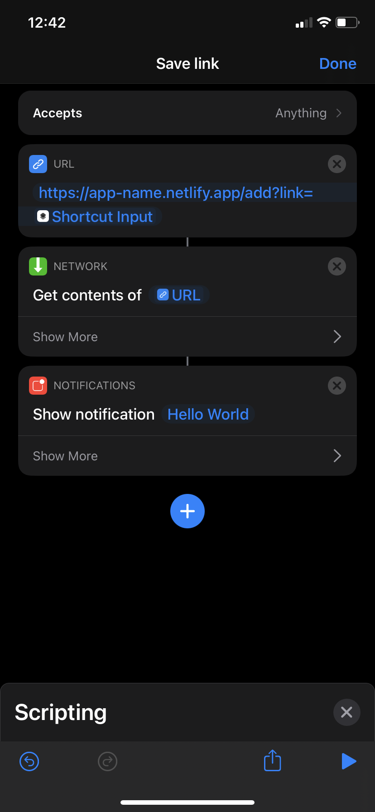

# Server-less Link Saving

## Overview

This is an application to learn Netlify Functions, Netlify's version of Lambda Functions or serverless functions. This application helps a user save links while browsing the web. The most common use for this application is while browsing on the go. Using Siri Shortcuts, I was able to add a custom option on the share sheet so that I can save the webpage to my own MongoDB instance. Then, those links that are stored are displayed on a website to be referenced at a later time, There is an option to mark a link as "read" as well as deleting links. Any links that is marked as 'read' is moved to the bottom of the list.

## Background

I've noticed a problem where I would visit a webpage, deem it helpful and would want to come back to it later. I would open a new tab to continue browsing so I can save that webpage on the previous tab. After a short while, I would have dozens of open tabs on my mobile browser. I decided to work on this issue and solved it with serverless functions. I chose Netlify as the hosting platform and MongoDB as the database provider. I also created a Siri Shortcut to enhance this application. Future development on a Google Extension will soon take place to provide additional functionality.

## Netlify Functions

Netlify offers their own flavor of serverless functions called Netlify Functions. These alow users to develop applications without needing to maintain a server. Applications are also inherently scalable and faster for the end user. Please read Netlify's documentation on Netlify Functions: [Netlify Docs (Functions)](https://docs.netlify.com/functions/overview/)

## Netlify CLI

The easiest way to develop this application is to install the Netlify CLI. Follow their official documentation to get started: [Netlify Docs (Getting Started)](https://docs.netlify.com/cli/get-started/)

## Environment Variables

Netlify offers the use of environment variables for your applications. To add environment variables to your netlify project, navigate to the settings area for your application called `Site settings`.

Then you will need to click on `Build & deploy` on the menu on the left.

Scroll down until you reach the `Environment` section or you can `Environment` under `Build & deploy` on the same menu.

You should see this screen:

Click edit to add an environment variable

We are going to add our environment variable for the MongoDB connection string. If you cloned this project, I called the MongoDB connection `MONGO_URI`, however you can call it whatever suits your needs. After you filled in the Key and Value fields, click save.

Please set this up before development! When you run `netlify dev` as we talked about earlier, the dev server will grab the environment variable for your application.

For more information on Netlify Functions, please visit the official docs: [Netlify Docs (Environment Variables)](https://docs.netlify.com/configure-builds/environment-variables/)

## Siri Shortcuts Setup (optional)

### Building the Shortcut

 Open the Shortcuts application, download it from the app store if you need to. Click on the "+" in the top right corner to create a new Shortcut

&nbsp; On the next screen, click on the circle with the three dots, this will open up the details page where we can edit some important settings. We need to change the name to something semantic, but what you call it is up to you. We also want to enable the "Show in Share Sheet" option as well. We can leave the "Share Sheet Types" option with the default value of "Anything".

We can also choose our own Color and Glyph for our shortcut. Choose a combo that works for you. Lots of options! Once you are done, close the details drawer by clicking "done".

&nbsp; We are ready to create the shortcut! slide up on the drawer an select the "Web" action category. Scroll down until you find the "URLs" section, within that section, select "URL".

&nbsp; We now need to add our application url into the "URL" action. Click on "apple.com" to edit the URL.  

&nbsp; Add your application URL. For example `https://super-cool-app-name.netlify.app/add?link=` As you are editing, you will see the "variables" section above the keyboard, scroll until you find the "Shortcut Input" variable. Click on the "Shortcut Input" variable on the action to set the type of input. We need to select the "URL" input type. 

&nbsp; We are now going to add an action to execute the URL action. Back to the "Web" action category, scroll down until you find the "Web Requests" method. Select the "Get Contents of URL" action. This should automatically fill the variable to be the "URL" action.

&nbsp; We are technically done with the shortcut, so these next steps are optional, but are handy to have. We are going to add the "Show Notification" action to our shortcut. To find the "Show Notification", click on the "Scripting" action category. Scroll down to the "Notification" section and click on "Show Notification". 

&nbsp; We now need to edit the contents of our notification. Instead of "Hello World", we are going to add the return message from the API endpoint we hit, this will help us know if the server added the link, by returning back to us a message that says `{"message":"Link Added :)"}` or if we encountered an error.

To change the notification message, delete "Hello World" While you are deleting, you should see variables that can be inserted, select the "Contents of URL" variable. We then need to change the type of this variable. When the "Contents of URL" variable is selected, you should see a tray to change its type. Click on the blue "as File", brining up all the type options for this variable. scroll down until you find "URL" and select that type. 

 We are now done with this shortcut! Give it try once you have deployed your application to Netlify. Happy Saving, Happy Reading! 

## Google Chrome Extension (Future)
